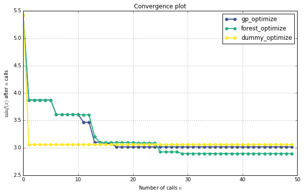

# Tuning a scikit-learn estimator with `skopt`

Gilles Louppe, July 2016.


```python
%matplotlib inline
import numpy as np
import matplotlib.pyplot as plt
plt.rcParams["figure.figsize"] = (10, 6)
```

    /home/travis/miniconda3/envs/testenv/lib/python3.5/site-packages/matplotlib/font_manager.py:273: UserWarning: Matplotlib is building the font cache using fc-list. This may take a moment.
      warnings.warn('Matplotlib is building the font cache using fc-list. This may take a moment.')
    /home/travis/miniconda3/envs/testenv/lib/python3.5/site-packages/matplotlib/font_manager.py:273: UserWarning: Matplotlib is building the font cache using fc-list. This may take a moment.
      warnings.warn('Matplotlib is building the font cache using fc-list. This may take a moment.')


## Problem statement

Tuning the hyper-parameters of a machine learning model is often carried out using an exhaustive exploration of (a subset of) the space all hyper-parameter configurations (e.g., using `sklearn.model_selection.GridSearchCV`), which often results in a very time consuming operation. 

In this notebook, we illustrate how `skopt` can be used to tune hyper-parameters using sequential model-based optimisation, hopefully resulting in equivalent or better solutions, but within less evaluations.

## Objective 

The first step is to define the objective function we want to minimize, in this case the cross-validation mean absolute error of a gradient boosting regressor over the Boston dataset, as a function of its hyper-parameters:


```python
from sklearn.datasets import load_boston
from sklearn.ensemble import GradientBoostingRegressor
from sklearn.model_selection import cross_val_score

boston = load_boston()
X, y = boston.data, boston.target
reg = GradientBoostingRegressor(n_estimators=50, random_state=0)

def objective(params):
    max_depth, learning_rate, max_features, min_samples_split, min_samples_leaf = params

    reg.set_params(max_depth=max_depth,
                   learning_rate=learning_rate,
                   max_features=max_features,
                   min_samples_split=min_samples_split, 
                   min_samples_leaf=min_samples_leaf)

    return -np.mean(cross_val_score(reg, X, y, cv=5, n_jobs=-1, scoring="mean_absolute_error"))
```

Next, we need to define the bounds of the dimensions of the search space we want to explore, and (optionally) the starting point:


```python
space  = [(1, 5),                           # max_depth
          (10**-5, 10**-1, "log-uniform"),  # learning_rate
          (1, X.shape[1]),                  # max_features
          (2, 30),                          # min_samples_split
          (1, 30)]                          # min_samples_leaf

x0 = [3, 0.01, 6, 2, 1]
```

## Optimize all the things!

With these two pieces, we are now ready for sequential model-based optimisation. Here we compare gaussian process-based optimisation versus forest-based optimisation.


```python
from skopt import gp_minimize
res_gp = gp_minimize(objective, space, x0=x0, n_calls=50, random_state=0)
```


```python
"Best score=%.4f" % res_gp.fun
```


    'Best score=2.8879'


```python
print("""Best parameters:
- max_depth=%d
- learning_rate=%.6f
- max_features=%d
- min_samples_split=%d
- min_samples_leaf=%d""" % (res_gp.x[0], res_gp.x[1], 
                            res_gp.x[2], res_gp.x[3], 
                            res_gp.x[4]))
```

    Best parameters:
    - max_depth=5
    - learning_rate=0.099611
    - max_features=8
    - min_samples_split=15
    - min_samples_leaf=5


```python
from skopt import forest_minimize
res_forest = forest_minimize(objective, space, x0=x0, n_calls=50, random_state=0)
```


```python
"Best score=%.4f" % res_forest.fun
```


    'Best score=2.9195'


```python
print("""Best parameters:
- max_depth=%d
- learning_rate=%.6f
- max_features=%d
- min_samples_split=%d
- min_samples_leaf=%d""" % (res_forest.x[0], res_forest.x[1], 
                            res_forest.x[2], res_forest.x[3], 
                            res_forest.x[4]))
```

    Best parameters:
    - max_depth=4
    - learning_rate=0.089097
    - max_features=8
    - min_samples_split=6
    - min_samples_leaf=3


As a baseline, let us also compare with random search in the space of hyper-parameters, which is equivalent to `sklearn.model_selection.RandomizedSearchCV`.


```python
from skopt import dummy_minimize
res_dummy = dummy_minimize(objective, space, x0=x0, n_calls=50, random_state=0)
```


```python
"Best score=%.4f" % res_dummy.fun
```


    'Best score=3.0592'


```python
print("""Best parameters:
- max_depth=%d
- learning_rate=%.4f
- max_features=%d
- min_samples_split=%d
- min_samples_leaf=%d""" % (res_dummy.x[0], res_dummy.x[1], 
                            res_dummy.x[2], res_dummy.x[3], 
                            res_dummy.x[4]))
```

    Best parameters:
    - max_depth=5
    - learning_rate=0.0596
    - max_features=10
    - min_samples_split=23
    - min_samples_leaf=1


## Convergence plot


```python
from skopt.plots import plot_convergence
plot_convergence(("gp_optimize", res_gp),
                 ("forest_optimize", res_forest),
                 ("dummy_optimize", res_dummy))
```


    <matplotlib.axes._subplots.AxesSubplot at 0x7f112152ec18>




